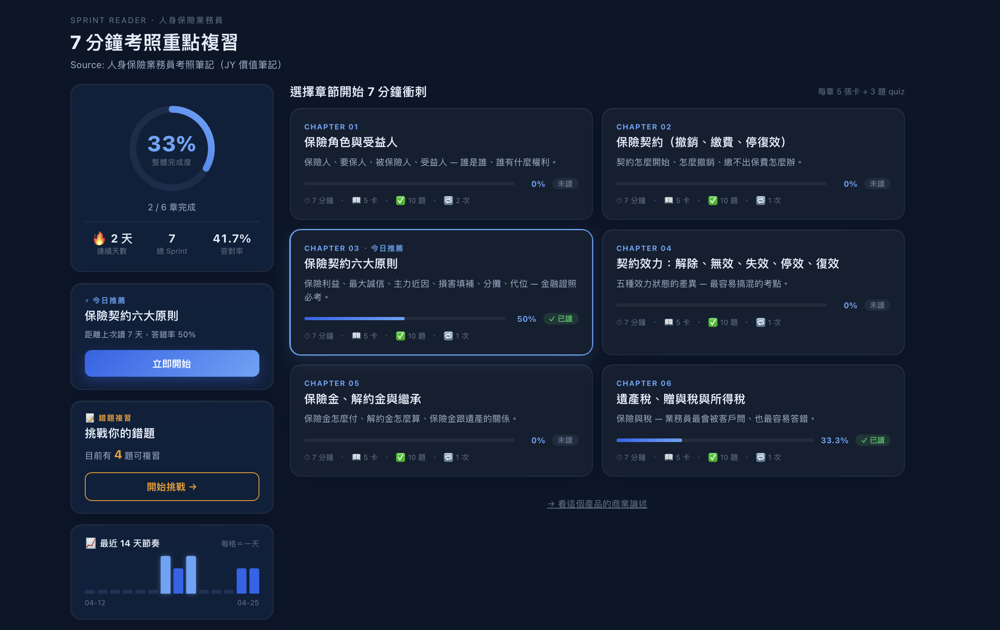

# Sprint Reader — 7 分鐘保險考照微學習 App

> 利用零碎時間複習人身保險考照重點，透過「即將測驗」機制強化主動閱讀與認知留存。

## 🔗 Live Demo

| | 連結 |
|---|---|
| **主 Demo** | https://rayhuang.pythonanywhere.com/ui/ |
| **商業論述** | https://rayhuang.pythonanywhere.com/ui/brief.html |
| **資料模型** | https://rayhuang.pythonanywhere.com/ui/architecture-data-model.html |

---

## 畫面預覽



**左側儀表板**
- 整體完成度、連續學習天數、累計 Sprint 次數、總答對率
- **今日推薦**：根據「答錯率 × 距上次複習天數」自動推算最需複習的章節
- **錯題複習**：匯集所有答錯紀錄，一鍵進入專項練習

**右側章節卡（6 章）**
- 每章顯示閱讀進度條、完成次數與該章答對率
- 點任一章節 → 7 分鐘閱讀衝刺 → 3 題即時測驗 → 分數 + 逐題解釋 + 原文卡片回溯

---

## 解決的問題

保險業務員備考時間有限，傳統 PDF 複習方式難以持續。**Sprint Reader** 把 110 頁考照筆記切成 6 章，每章 7 分鐘，讀完立即接 3 題測驗，強迫主動提取記憶。

**核心設計**：
- **7 分鐘限時閱讀** — 通勤、等候的零碎時間就能完成一章
- **即時 Quiz** — 每章閱讀後立即測驗 3 題，搭配解釋與原文卡片回溯
- **間隔重複推薦** — 根據答錯率與距上次複習天數，自動推薦優先章節
- **行為遙測** — 記錄 `tab_switch_count`、閱讀時間、完成狀態，建立個人弱點圖譜
- **Server-authoritative timer** — 所有 timestamp 由後端蓋章，防止前端竄改

---

## Quick Start

```bash
bash run.sh
```

開瀏覽器：`http://localhost:8000/ui/`

第一次執行會自動建 venv、裝套件、建 DB，約 30 秒後啟動。

---

## Tech Stack

| Layer | 選擇 | 原因 |
|---|---|---|
| Backend | FastAPI | 自帶 OpenAPI 文件；async 架構好擴充 |
| DB | SQLite | 零依賴、易啟動、schema 清晰 |
| Frontend | Vanilla HTML/CSS/JS | 無 build step、無 framework、快速啟動 |
| Timer | Browser Visibility API + 後端 timestamp | UX 自然 + 防前端竄改 |

---

## 資料庫設計（9 張表）

| 分類 | 資料表 | 用途 |
|---|---|---|
| 核心 | `FlashcardPages` | 6 章 × 5 張閱讀卡內容 |
| 核心 | `SprintSessions` | 每次閱讀的行為紀錄（timer、tab 切換、完成狀態） |
| 核心 | `LearningJourney_Map` | 閱讀與測驗的橋接表，記錄最終分數 |
| 測驗 | `QuizQuestions` | 6 章 × 3 題，含選項、正解、解釋 |
| 測驗 | `QuizResponses` | 每題作答紀錄，可分析使用者盲點 |
| 推薦 | `ChapterMastery` | 每章答對率 + 距上次複習天數，驅動間隔重複推薦 |
| 推薦 | `ReviewEvents` | 每次推薦事件的觸發紀錄 |
| 支援 | `MicroModules` | 章節 metadata（標題、卡片數、預估時間） |
| 支援 | `Agents` | 系統 agent 設定（預留 AI 推薦擴充） |

---

## 資料夾結構

```
sprint-reader/
├── run.sh
├── init_db.py                   ← 建表 + seed 6 章內容與題庫
├── app/
│   ├── main.py
│   ├── db.py
│   ├── routes/
│   │   ├── module.py            ← GET /api/module
│   │   ├── sprint.py            ← POST /api/sprint/{start,telemetry,complete}
│   │   ├── quiz.py              ← GET /api/quiz, POST /api/quiz/submit, /finalize
│   │   └── handoff.py
│   └── services/
│       └── session_manager.py   ← 狀態機 + sprint_id + tab_switch
├── frontend/
│   ├── index.html               ← 章節選擇
│   ├── splash.html              ← Pre-Sprint 說明
│   ├── reader.html              ← 滑卡 + 計時器
│   ├── quiz.html                ← 即時測驗
│   ├── result.html              ← 分數 + 逐題檢討
│   ├── brief.html               ← 商業論述
│   └── assets/
│       ├── style.css
│       └── app.js
└── docs/
    └── schema.md
```

---

Ray Huang · Project 3 of 3
